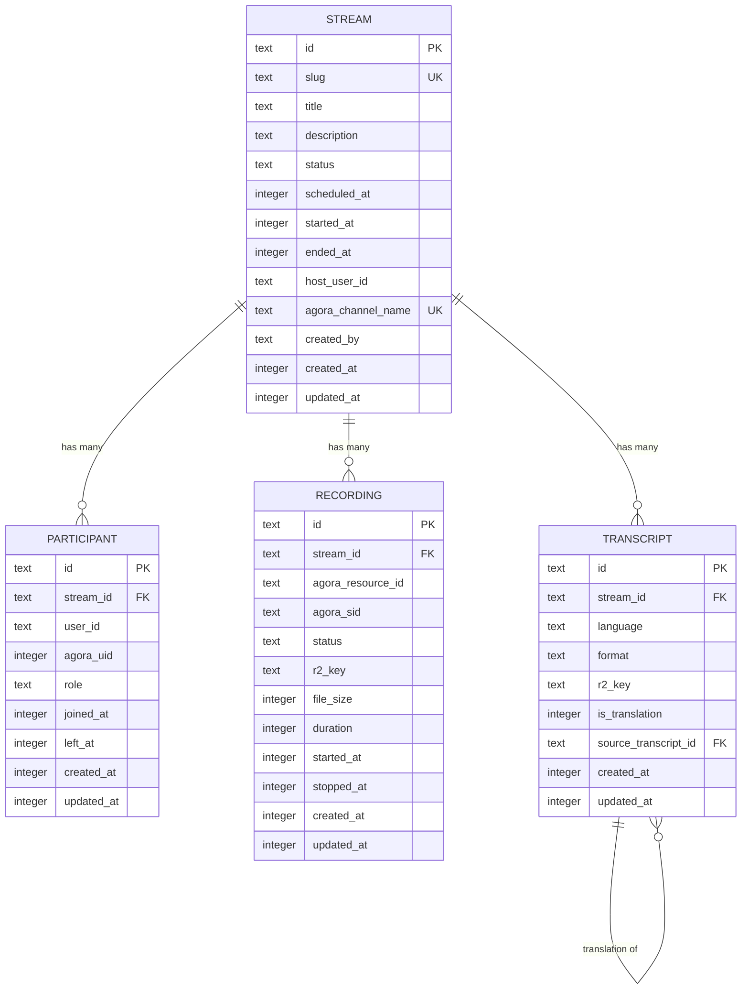

# feat: Agora.io Live Streaming Integration

## Overview

Integrate Agora.io's Interactive Live Streaming into the platform to enable one-to-many broadcasting with up to 1,000 concurrent viewers. The feature includes real-time closed captions (English/Chinese auto-detection), screen sharing, cloud recording with replay/download, and a role-based permission system. Hosts broadcast from desktop browsers; viewers watch on any device via responsive web at `/event/:slug`.

This is a net-new feature — no video, real-time, or streaming capabilities exist in the codebase today.

## Problem Statement / Motivation

The platform needs live streaming capabilities for broadcasting sessions to large audiences. Key requirements that drove the Agora.io decision (see brainstorm: `docs/brainstorms/2026-02-23-agora-live-streaming-brainstorm.md`):

- **Bilingual audience** — real-time transcription must auto-detect English and Chinese
- **Interactive hosting** — hosts must promote/demote speakers and transfer host role mid-stream
- **Recording and replay** — all streams recorded for on-demand viewing
- **Public access** — viewers join via shareable link without authentication
- **Scale** — support up to 1,000 concurrent viewers per stream

Agora was chosen over LiveKit (separate transcription provider needed) and Cloudflare Stream hybrid (latency and triple-service complexity). See brainstorm for full evaluation.

## Proposed Solution

### Architecture Overview

```
┌─────────────────────────────────────────────────────────────────┐
│  Frontend (apps/web/)  — Cloudflare Pages                       │
│  ┌──────────────┐  ┌──────────────┐  ┌───────────────────────┐  │
│  │ /event/:slug │  │ /dashboard/  │  │ agora-rtc-sdk-ng      │  │
│  │ (viewer +    │  │ streams/*    │  │ agora-rtc-react        │  │
│  │  host UI)    │  │ (admin)      │  │ protobuf.js (captions)│  │
│  └──────┬───────┘  └──────┬───────┘  └───────────┬───────────┘  │
│         │                 │                       │              │
└─────────┼─────────────────┼───────────────────────┼──────────────┘
          │                 │                       │
          ▼                 ▼                       ▼
┌─────────────────────────────────────┐  ┌─────────────────────┐
│  video-worker (workers/video-worker)│  │  Agora.io SD-RTN    │
│  Hono on Cloudflare Workers         │  │  ┌─────────────────┐│
│  ┌─────────────────────────────┐    │  │  │ Video SDK       ││
│  │ /api/streams   (CRUD)      │    │  │  │ Cloud Recording ││
│  │ /api/tokens    (Agora RTC) │    │  │  │ Real-Time STT   ││
│  │ /api/recording (lifecycle) │    │  │  └─────────────────┘│
│  │ /api/stt       (lifecycle) │    │  └─────────────────────┘
│  │ /health                    │    │
│  └─────────────────────────────┘    │
│  D1 Database (streams, participants)│
│  R2 Bucket (recordings)             │
└─────────────────────────────────────┘
```

### Agora Products Used

| Product | Purpose | NPM Package |
|---------|---------|-------------|
| Video SDK (Web) | Core streaming, role management | `agora-rtc-sdk-ng` (v4.24.x) |
| React SDK | React hooks and components | `agora-rtc-react` (v2.x) |
| Cloud Recording | Server-side recording to R2 | REST API (no client package) |
| Real-Time STT | Live captions (EN/ZH auto-detect) | REST API + protobuf client |
| Token Server | Secure token generation | `agora-token` |

### Stream State Machine

```
                 ┌──────────┐
                 │  draft   │ (Admin creating, not yet published)
                 └────┬─────┘
                      │ Admin publishes
                      ▼
                 ┌──────────┐
                 │scheduled │ (Visible at /event/:slug, placeholder shown)
                 └────┬─────┘
                      │ Scheduled time reached (viewers see countdown → 0)
                      ▼
                 ┌──────────┐
                 │pre_stream│ (Countdown at zero, waiting for host to go live)
                 └────┬─────┘
                      │ Host clicks "Go Live"
                      ▼
                 ┌──────────┐
          ┌──────│   live   │──────┐
          │      └────┬─────┘      │
          │           │            │ Host disconnects (30s timeout)
          │           │            ▼
          │           │      ┌──────────┐
          │           │      │  paused  │──── Host reconnects ──→ live
          │           │      └────┬─────┘
          │           │           │ 30s timeout expires
          │           ▼           ▼
          │      ┌──────────┐
          │      │  ending  │ (Host/Admin clicks "End Stream")
          │      └────┬─────┘
          │           │ Recording finalized, uploaded to R2
          │           ▼
          │      ┌──────────────┐
          │      │ processing   │ (Recording being finalized)
          │      └────┬─────────┘
          │           │ Recording available
          │           ▼
          │      ┌──────────┐
          └──────│completed │ (Replay available at /event/:slug)
                 └──────────┘

    ──────── cancelled ──────── (Admin cancels at any pre-live state)
```

## Technical Approach

### User Roles and Permissions

(see brainstorm: `docs/brainstorms/2026-02-23-agora-live-streaming-brainstorm.md` — Key Decisions)

| Role | Auth Required | Agora Role | Capabilities |
|------|--------------|------------|-------------|
| **Admin** | Yes | `audience` (level 2) | Schedule streams, assign hosts, watch, raise hand, download recordings, end stream |
| **Host** | Yes | `host` | Broadcast A/V/screen, promote/demote speakers, transfer host role, start/end stream |
| **Speaker** | Yes | `host` (promoted) | Broadcast A/V/screen (promoted by host, can be demoted) |
| **Viewer** | No | `audience` (level 1) | Watch-only — no interactions |

**Key decisions:**
- Speaker promotion **requires authentication**. If a viewer wants to be promoted, they must sign in first. This prevents issuing broadcaster tokens to anonymous users.
- Admins raise hands via the platform signaling layer. The host sees a hand-raise queue and can promote from it.
- Maximum **4 concurrent speakers** (including host) to manage bandwidth and layout complexity.
- Host transfer: original host becomes a Speaker after transfer (can still broadcast, but loses host controls).

### Token Issuance Strategy

| Token Type | Recipient | Agora Role | Issued By | Authorization |
|------------|-----------|------------|-----------|---------------|
| Viewer token | Unauthenticated viewer | `RtcRole.SUBSCRIBER` | `GET /api/tokens/viewer` | Rate-limited (IP-based, 10 req/min per IP) |
| Host token | Authenticated host | `RtcRole.PUBLISHER` | `GET /api/tokens/host` | Auth required + must be assigned host for this stream |
| Speaker token | Authenticated admin | `RtcRole.PUBLISHER` | `GET /api/tokens/speaker` | Auth required + must be promoted by host |
| Screen share token | Host/Speaker | `RtcRole.PUBLISHER` | `GET /api/tokens/screen` | Auth required + separate UID for screen client |
| Recording token | Cloud Recording bot | `RtcRole.SUBSCRIBER` | Internal (video-worker) | Server-side only |
| STT token | STT bot | `RtcRole.SUBSCRIBER` | Internal (video-worker) | Server-side only |

Token expiration: **1 hour** with client-side auto-renewal via `token-privilege-will-expire` event.

### Real-Time Signaling

Use **Agora data stream messages** (via `client.sendStreamMessage()` and `stream-message` event) for lightweight signaling rather than adding Agora RTM as a dependency. This keeps the integration simpler.

Signaling messages (JSON-encoded):

| Message Type | Direction | Payload |
|-------------|-----------|---------|
| `stream_status` | Host → All | `{ type: "stream_status", status: "live" \| "paused" \| "ending" }` |
| `hand_raise` | Admin → Host | `{ type: "hand_raise", uid: number, name: string }` |
| `hand_lower` | Admin → Host | `{ type: "hand_lower", uid: number }` |
| `promote_speaker` | Host → Target | `{ type: "promote_speaker", uid: number }` |
| `demote_speaker` | Host → Target | `{ type: "demote_speaker", uid: number }` |
| `transfer_host` | Host → Target | `{ type: "transfer_host", uid: number }` |

**Limitation:** Data stream messages can only be sent by hosts (publishers). For hand-raise from Admins (who are audience), we use the video-worker API as a relay:
1. Admin sends `POST /api/streams/:id/hand-raise` to video-worker
2. Video-worker stores the hand-raise and returns to host via polling or SSE

### Database Schema (D1 / Drizzle ORM)

Following existing conventions from `workers/auth-worker/src/db/schema.ts` — text PKs, integer timestamps, snake_case SQL columns, camelCase TypeScript.

```typescript
// workers/video-worker/src/db/schema.ts

import { text, integer, sqliteTable } from "drizzle-orm/sqlite-core";

// ─── Streams ────────────────────────────────────────────────────

export const stream = sqliteTable("stream", {
  id: text("id").primaryKey(),                    // nanoid
  slug: text("slug").notNull().unique(),          // human-readable URL slug
  title: text("title").notNull(),
  description: text("description"),
  status: text("status").notNull()                // draft|scheduled|pre_stream|live|paused|ending|processing|completed|cancelled
    .$type<"draft" | "scheduled" | "pre_stream" | "live" | "paused" | "ending" | "processing" | "completed" | "cancelled">(),
  scheduledAt: integer("scheduled_at", { mode: "timestamp" }).notNull(),
  startedAt: integer("started_at", { mode: "timestamp" }),
  endedAt: integer("ended_at", { mode: "timestamp" }),
  hostUserId: text("host_user_id").notNull(),     // assigned host (references auth user)
  agoraChannelName: text("agora_channel_name").notNull().unique(),
  createdBy: text("created_by").notNull(),        // admin who created the stream
  createdAt: integer("created_at", { mode: "timestamp" }).$defaultFn(() => new Date()),
  updatedAt: integer("updated_at", { mode: "timestamp" }).$defaultFn(() => new Date()).$onUpdate(() => new Date()),
});

// ─── Participants ───────────────────────────────────────────────

export const participant = sqliteTable("participant", {
  id: text("id").primaryKey(),
  streamId: text("stream_id").notNull().references(() => stream.id),
  userId: text("user_id"),                        // null for anonymous viewers
  agoraUid: integer("agora_uid").notNull(),
  role: text("role").notNull()                    // host|speaker|admin|viewer
    .$type<"host" | "speaker" | "admin" | "viewer">(),
  joinedAt: integer("joined_at", { mode: "timestamp" }).$defaultFn(() => new Date()),
  leftAt: integer("left_at", { mode: "timestamp" }),
  createdAt: integer("created_at", { mode: "timestamp" }).$defaultFn(() => new Date()),
  updatedAt: integer("updated_at", { mode: "timestamp" }).$defaultFn(() => new Date()).$onUpdate(() => new Date()),
});

// ─── Recordings ─────────────────────────────────────────────────

export const recording = sqliteTable("recording", {
  id: text("id").primaryKey(),
  streamId: text("stream_id").notNull().references(() => stream.id),
  agoraResourceId: text("agora_resource_id"),
  agoraSid: text("agora_sid"),
  status: text("status").notNull()                // recording|processing|ready|failed
    .$type<"recording" | "processing" | "ready" | "failed">(),
  r2Key: text("r2_key"),                          // R2 object key for the recording file
  fileSize: integer("file_size"),                  // bytes
  duration: integer("duration"),                   // seconds
  startedAt: integer("started_at", { mode: "timestamp" }),
  stoppedAt: integer("stopped_at", { mode: "timestamp" }),
  createdAt: integer("created_at", { mode: "timestamp" }).$defaultFn(() => new Date()),
  updatedAt: integer("updated_at", { mode: "timestamp" }).$defaultFn(() => new Date()).$onUpdate(() => new Date()),
});

// ─── Transcripts ────────────────────────────────────────────────

export const transcript = sqliteTable("transcript", {
  id: text("id").primaryKey(),
  streamId: text("stream_id").notNull().references(() => stream.id),
  language: text("language").notNull(),           // en-US, zh-CN, etc.
  format: text("format").notNull()                // vtt|srt|json
    .$type<"vtt" | "srt" | "json">(),
  r2Key: text("r2_key"),                          // R2 object key for transcript file
  isTranslation: integer("is_translation", { mode: "boolean" }).notNull().default(false),
  sourceTranscriptId: text("source_transcript_id").references(() => transcript.id),
  createdAt: integer("created_at", { mode: "timestamp" }).$defaultFn(() => new Date()),
  updatedAt: integer("updated_at", { mode: "timestamp" }).$defaultFn(() => new Date()).$onUpdate(() => new Date()),
});
```

### ERD



### API Design (video-worker)

```
# Stream Management (Admin, authenticated)
POST   /api/streams                    # Create stream (draft)
GET    /api/streams                    # List streams (admin dashboard)
GET    /api/streams/:id                # Get stream details
PATCH  /api/streams/:id                # Update stream (title, schedule, host)
DELETE /api/streams/:id                # Cancel/delete stream
POST   /api/streams/:id/publish        # Transition draft → scheduled

# Public Stream Access (no auth)
GET    /api/streams/by-slug/:slug      # Get stream by slug (for /event/:slug page)

# Token Generation
GET    /api/tokens/viewer?channel=X    # Viewer token (rate-limited, no auth)
GET    /api/tokens/host?stream=X       # Host token (auth required)
GET    /api/tokens/speaker?stream=X    # Speaker token (auth required, must be promoted)
GET    /api/tokens/screen?stream=X     # Screen share token (auth required)

# Stream Control (Host, authenticated)
POST   /api/streams/:id/go-live        # Transition pre_stream → live (starts recording + STT)
POST   /api/streams/:id/end            # Transition live → ending → processing
POST   /api/streams/:id/pause          # Transition live → paused
POST   /api/streams/:id/resume         # Transition paused → live

# Hand Raise (Admin, authenticated — relay for signaling)
POST   /api/streams/:id/hand-raise     # Admin raises hand
DELETE /api/streams/:id/hand-raise     # Admin lowers hand
GET    /api/streams/:id/hand-raises    # Host polls for raised hands

# Recording (internal, called by go-live/end)
POST   /api/recording/start            # Acquire + start cloud recording
POST   /api/recording/stop             # Stop cloud recording
GET    /api/recording/status/:sid      # Query recording status

# STT (internal, called by go-live/end)
POST   /api/stt/start                  # Start STT agent
POST   /api/stt/stop                   # Stop STT agent

# Recording Access
GET    /api/recordings/:streamId       # Get recording metadata
GET    /api/recordings/:streamId/url   # Get signed R2 download URL (admin, auth)

# Health
GET    /health
```

### Frontend Routes

Following TanStack Router file-based routing conventions from `apps/web/src/routes/`.

| File | Route | Auth | Purpose |
|------|-------|------|---------|
| `event.$slug.tsx` | `/event/:slug` | No | Public stream page (viewer + host UI based on role) |
| `dashboard.streams.tsx` | `/dashboard/streams` | Yes | Admin stream list |
| `dashboard.streams.new.tsx` | `/dashboard/streams/new` | Yes | Create new stream form |
| `dashboard.streams.$id.tsx` | `/dashboard/streams/:id` | Yes | Edit stream details |
| `dashboard.streams.$id.recordings.tsx` | `/dashboard/streams/:id/recordings` | Yes | View/download recordings |

The `/event/:slug` route renders different UI based on the viewer's role:
- **Unauthenticated viewer**: Video player + captions, no controls
- **Authenticated admin**: Video player + captions + hand-raise button
- **Assigned host**: Full broadcast controls, speaker management panel, screen share, go-live/end buttons
- **Promoted speaker**: A/V broadcast controls, screen share
- **Pre-stream (any role)**: Placeholder image/video + countdown timer

### Screen Sharing Architecture

Screen sharing requires a second Agora client instance with a separate UID and token (see brainstorm). The convention:

- **Camera UID**: assigned UID (e.g., `12345`)
- **Screen share UID**: camera UID + 100000 (e.g., `112345`)

On the subscriber side, UIDs >= 100000 are rendered as screen share tracks (larger, possibly full-width) rather than camera tracks.

```typescript
// Host starts screen sharing
const screenClient = AgoraRTC.createClient({ mode: "live", codec: "vp8" });
const screenToken = await fetchToken("screen", streamId);
await screenClient.join(appId, channelName, screenToken, screenUid);
screenClient.setClientRole("host");
const screenTrack = await AgoraRTC.createScreenVideoTrack();
await screenClient.publish(screenTrack);
```

### Caption / Transcription Flow

1. When stream goes live, video-worker calls Agora STT REST API to start an STT agent
2. STT agent joins the Agora channel, subscribes to host/speaker audio
3. STT agent produces transcription as protobuf-encoded data stream messages
4. All clients receive via the `stream-message` event
5. Client decodes protobuf using `SttMessage.proto` schema
6. Captions rendered at the bottom of the video player (closed-captioning style)
7. Captions include `isFinal` flag — interim results shown with lower opacity, final results replace them
8. Speaker UID included in message for multi-speaker attribution

**Language configuration:** Specify `["en-US", "zh-CN"]` as source languages to enable Language Identification (auto-detection). Cost: additional $5.00/1,000 minutes.

**Post-stream transcript:** After the stream ends, aggregate all `isFinal: true` transcription segments, convert to VTT/SRT format, and store in R2. The transcript record links to the stream and stores the language.

### Host Disconnection Handling

1. Agora SDK fires `connection-state-change` → `"RECONNECTING"`
2. Video-worker detects host absence after 30 seconds (via Agora webhook or polling)
3. Stream transitions to `paused` state
4. Viewers see "Host temporarily disconnected — waiting for reconnection..."
5. If host reconnects within 30 seconds, stream resumes to `live`
6. If 30 seconds expire without reconnection, stream auto-ends → `ending` → `processing`
7. Cloud Recording continues during the 30-second window to avoid data loss

### Pre-Stream Experience

1. Viewer navigates to `/event/:slug`
2. If `stream.status === "scheduled"`, show:
   - Global default placeholder image/video (configured as a static asset or R2 object)
   - Countdown timer to `stream.scheduledAt`
   - Stream title and description
3. When countdown reaches zero, transition UI to "Waiting for host to go live..."
4. When host clicks "Go Live", stream status changes to `live`, viewer auto-subscribes to host tracks

## System-Wide Impact

### Interaction Graph

- **Go Live** triggers: stream status update (D1) → Cloud Recording acquire + start (Agora REST) → STT agent start (Agora REST) → data stream status message to all clients → viewer UI update
- **End Stream** triggers: data stream status message → STT stop (Agora REST) → Cloud Recording stop (Agora REST) → recording processing → R2 upload → transcript aggregation → stream status update (D1)
- **Promote Speaker** triggers: host sends data stream message → target client calls `setClientRole("host")` → target requests publisher token from video-worker → target publishes tracks → all viewers auto-subscribe

### Error Propagation

| Error | Impact | Handling |
|-------|--------|----------|
| Token generation fails | User cannot join channel | Retry with exponential backoff; show error to user |
| Cloud Recording `acquire` fails | No recording | Retry once; warn host; allow stream to proceed without recording |
| Cloud Recording `start` fails | No recording | Retry once; warn host; stream continues |
| STT `start` fails | No captions | Retry once; show "Captions unavailable" indicator |
| STT drops mid-stream | Captions stop | Health check via periodic query; auto-restart if detected |
| Host token expires mid-stream | Host kicked from channel | Auto-renewal via `token-privilege-will-expire` event |
| R2 upload fails | Recording lost | Retry from Agora's temporary storage (available for 24 hours) |

### State Lifecycle Risks

- **Partial failure during "Go Live":** Recording starts but STT fails → stream is live without captions. Mitigation: treat recording and STT as independent; partial success is acceptable.
- **Orphaned recordings:** If stream ends abnormally and `stop` is never called, Agora auto-stops after `maxIdleTime` (30s). Files are still uploaded to R2. The processing step must handle this.
- **Stale stream status:** If video-worker crashes after `go-live` but before updating D1, the database shows `pre_stream` but the Agora channel is active. Mitigation: health check endpoint that queries Agora channel status.

### API Surface Parity

New API surface is entirely additive — no existing endpoints are modified:
- `workers/video-worker/` — all new routes
- `apps/web/src/routes/event.$slug.tsx` — new route
- `apps/web/src/routes/dashboard.streams.*` — new routes
- `packages/shared/src/types/` — new types added alongside existing ones

### Integration Test Scenarios

1. **Full stream lifecycle:** Admin creates stream → host goes live → viewer watches → speaker promoted → host ends stream → recording available → viewer replays
2. **Host disconnection mid-stream:** Host leaves → 30s timeout → stream auto-ends → recording is complete
3. **Token renewal during long stream:** Token expires → auto-renewal fires → stream continues without interruption
4. **Recording failure recovery:** Cloud Recording start fails → stream continues → host is warned → stream ends → no recording available but no crash
5. **Concurrent viewer limit:** 1,000 viewers connect → 1,001st viewer gets graceful "stream is full" message

## Acceptance Criteria

### Functional Requirements

- [ ] Admin can create, schedule, and publish a stream from `/dashboard/streams/new`
- [ ] Admin can assign a host user to a stream
- [ ] Admin can cancel or reschedule a stream
- [ ] Public `/event/:slug` page shows placeholder + countdown before stream starts
- [ ] Host can preview their A/V before clicking "Go Live"
- [ ] Host can broadcast camera, microphone, and screen share simultaneously
- [ ] Host can promote an admin to speaker mid-stream
- [ ] Host can demote a speaker back to audience mid-stream
- [ ] Host can transfer host role to another admin
- [ ] Host can end the stream
- [ ] Up to 1,000 concurrent viewers can watch the stream
- [ ] Viewers see real-time closed captions in the speaker's language (English or Chinese)
- [ ] Captions auto-detect between English and Chinese
- [ ] Stream is recorded via Agora Cloud Recording
- [ ] Recording is stored in Cloudflare R2
- [ ] Viewers can replay the recording at `/event/:slug` after stream ends
- [ ] Admins can download the recording from the dashboard
- [ ] Token auto-renewal prevents mid-stream disconnections

### Non-Functional Requirements

- [ ] Viewer page is responsive across desktop, tablet, and mobile
- [ ] Video latency < 2 seconds for interactive live streaming (ultra-low latency audience)
- [ ] Caption latency < 3 seconds from spoken word to displayed text
- [ ] Token endpoint for viewers rate-limited to 10 requests/min per IP
- [ ] All Agora secrets stored in `.dev.vars` locally and `wrangler secret put` for production
- [ ] No Agora App Certificate or Customer Secret exposed client-side

### Quality Gates

- [ ] Unit tests for video-worker endpoints (Vitest + Cloudflare pool workers)
- [ ] E2E tests for stream scheduling flow (Playwright)
- [ ] Manual testing of full stream lifecycle with 2+ participants
- [ ] Manual testing of screen sharing on Chrome, Firefox, Safari
- [ ] Manual testing of caption rendering on desktop and mobile

## Implementation Phases

### Phase 1: Foundation (Backend)

**Goal:** Video worker with stream CRUD, database schema, and Agora token generation.

**Tasks:**

- [x] Scaffold `workers/video-worker/` following auth-worker pattern
  - `src/index.ts` — Hono app with CORS, health endpoint
  - `src/env.d.ts` — Env interface (D1, R2, Agora secrets)
  - `wrangler.toml` — D1 + R2 bindings, dev port 8789
  - `package.json`, `tsconfig.json`, `vitest.config.ts`, `drizzle.config.ts`
- [x] Create D1 database schema (`stream`, `participant`, `recording`, `transcript` tables)
- [x] Run `drizzle-kit generate` and apply migrations
- [x] Implement stream CRUD endpoints (`/api/streams`)
- [x] Implement Agora token generation (`/api/tokens/*`) using `agora-token` package
- [x] Add shared types to `packages/shared/src/types/` (`Stream`, `Participant`, `Recording`, `Transcript`)
- [x] Add rate limiting for viewer token endpoint
- [x] Unit tests for all endpoints
- [x] Register video-worker in Playwright webServer config for e2e

**Key files:**
- `workers/video-worker/src/index.ts`
- `workers/video-worker/src/db/schema.ts`
- `workers/video-worker/src/lib/agora-token.ts`
- `workers/video-worker/src/routes/streams.ts`
- `workers/video-worker/src/routes/tokens.ts`
- `packages/shared/src/types/stream.ts`

### Phase 2: Core Streaming (Frontend)

**Goal:** Host can broadcast, viewer can watch, basic role management works.

**Tasks:**

- [ ] Install `agora-rtc-sdk-ng` and `agora-rtc-react` in `apps/web`
- [ ] Create Agora client library (`apps/web/src/lib/agora-client.ts`)
- [ ] Create video-worker client library (`apps/web/src/lib/video-client.ts`)
- [ ] Build `/event/:slug` route with role-based rendering:
  - Pre-stream: placeholder + countdown
  - Live (viewer): video player subscribing to host/speaker tracks
  - Live (host): broadcast controls, "Go Live" / "End Stream" buttons
  - Post-stream: replay player (Phase 4)
- [ ] Implement host broadcast flow: create tracks → join channel → publish
- [ ] Implement viewer subscribe flow: join channel as audience → subscribe to published tracks
- [ ] Implement role switching: `setClientRole("host" | "audience")`
- [ ] Implement speaker promotion/demotion UI (host panel)
- [ ] Implement hand-raise flow (admin → video-worker → host polls)
- [ ] Implement host transfer UI
- [ ] Implement token auto-renewal (`token-privilege-will-expire` handler)
- [ ] Implement connection state monitoring and reconnection UI

**Key files:**
- `apps/web/src/routes/event.$slug.tsx`
- `apps/web/src/lib/agora-client.ts`
- `apps/web/src/lib/video-client.ts`
- `apps/web/src/components/stream/VideoPlayer.tsx`
- `apps/web/src/components/stream/HostControls.tsx`
- `apps/web/src/components/stream/SpeakerPanel.tsx`

### Phase 3: Screen Sharing + Captions

**Goal:** Screen sharing works with dual clients, real-time captions displayed.

**Tasks:**

- [ ] Implement dual-client screen sharing (camera client + screen client with UID offset)
- [ ] Handle screen share track rendering on viewer side (detect UID >= 100000)
- [ ] Implement screen share layout (screen share as primary, camera as PiP)
- [ ] Build STT lifecycle endpoints in video-worker (`/api/stt/start`, `/api/stt/stop`)
- [ ] Integrate STT start/stop with "Go Live" / "End Stream" flow
- [ ] Add `protobufjs` to `apps/web` for decoding STT data stream messages
- [ ] Implement caption rendering component (closed-captioning style at bottom of video)
- [ ] Handle interim vs. final transcription results (opacity difference)
- [ ] Handle multi-speaker caption attribution
- [ ] Implement STT health monitoring (periodic status checks, auto-restart on failure)

**Key files:**
- `apps/web/src/components/stream/ScreenShare.tsx`
- `apps/web/src/components/stream/Captions.tsx`
- `apps/web/src/lib/stt-decoder.ts`
- `workers/video-worker/src/routes/stt.ts`
- `workers/video-worker/src/lib/agora-stt.ts`

### Phase 4: Recording + Replay

**Goal:** Streams are recorded, viewers can replay, admins can download.

**Tasks:**

- [ ] Configure R2 bucket (`stream-recordings`) in video-worker wrangler.toml
- [ ] Build Cloud Recording lifecycle endpoints (`/api/recording/start`, `/stop`, `/status`)
- [ ] Integrate recording start/stop with "Go Live" / "End Stream" flow
- [ ] Configure S3-compatible storage in Cloud Recording API (`vendor: 11`, R2 endpoint)
- [ ] Implement recording health monitoring (periodic `query` calls during stream)
- [ ] Handle recording failure gracefully (warn host, continue stream)
- [ ] Build post-stream replay UI at `/event/:slug` (video player with R2-served recording)
- [ ] Generate transcript files (VTT format) from aggregated STT data after stream ends
- [ ] Store transcripts in R2 and record metadata in D1
- [ ] Build signed URL generation for admin recording download
- [ ] Implement recording processing detection (polling until files are available in R2)

**Key files:**
- `workers/video-worker/src/routes/recording.ts`
- `workers/video-worker/src/lib/agora-recording.ts`
- `workers/video-worker/src/lib/transcript-generator.ts`
- `apps/web/src/components/stream/ReplayPlayer.tsx`

### Phase 5: Admin Dashboard

**Goal:** Full admin interface for managing streams and recordings.

**Tasks:**

- [ ] Build `/dashboard/streams` — list of all streams with status badges
- [ ] Build `/dashboard/streams/new` — create stream form (title, description, date/time, host assignment)
- [ ] Build `/dashboard/streams/:id` — edit stream, view status, cancel/reschedule
- [ ] Build `/dashboard/streams/:id/recordings` — view recording status, download link
- [ ] Implement slug generation (from title, with uniqueness check)
- [ ] Add stream scheduling validation (future dates only, no conflicts)

**Key files:**
- `apps/web/src/routes/dashboard.streams.tsx`
- `apps/web/src/routes/dashboard.streams.new.tsx`
- `apps/web/src/routes/dashboard.streams.$id.tsx`
- `apps/web/src/routes/dashboard.streams.$id.recordings.tsx`

## Alternative Approaches Considered

(see brainstorm: `docs/brainstorms/2026-02-23-agora-live-streaming-brainstorm.md` — Why Agora.io)

1. **LiveKit Cloud** — Open-source WebRTC platform. Rejected because transcription requires a separate provider (Deepgram), adding complexity. More setup for the broadcasting pattern.
2. **Cloudflare Stream + WebRTC hybrid** — Leverages existing Cloudflare infra. Rejected due to 10-30 second latency on broadcast leg (vs. 1-2 seconds with Agora) making captions feel out of sync.
3. **Agora RTM for signaling** — Considered using Agora's Real-Time Messaging for hand-raise and state sync. Deferred in favor of data stream messages + video-worker API relay to avoid an additional Agora product dependency.

## Dependencies & Prerequisites

- [ ] Agora.io account with App ID and App Certificate
- [ ] Agora Console: enable Cloud Recording and Real-Time STT
- [ ] Agora Customer Key and Customer Secret (for Cloud Recording + STT REST APIs)
- [ ] Cloudflare R2 bucket created (`stream-recordings`)
- [ ] R2 access key and secret for Agora Cloud Recording to write directly
- [ ] New D1 database created for video-worker (or shared with auth-worker if preferred)
- [ ] Global default placeholder image/video asset

## Risk Analysis & Mitigation

| Risk | Likelihood | Impact | Mitigation |
|------|-----------|--------|------------|
| Agora STT quality for EN/ZH auto-detection | Medium | High | Test early in Phase 3; fallback to single-language mode if needed |
| `agora-token` incompatible with Cloudflare Workers | Low | High | `nodejs_compat` flag should resolve; fallback to Web Crypto API reimplementation |
| Cloud Recording to R2 fails (S3-compat issues) | Low | High | Test in Phase 4 with a sample recording; R2 is well-tested S3-compatible |
| 1,000 viewer data stream delivery unreliable (captions) | Medium | Medium | Test at scale; fallback to HTTP polling for captions if data streams fail |
| Agora pricing higher than estimated | Low | Medium | Validate with Agora pricing calculator before Phase 2; use `level: 1` for most viewers |
| Host disconnection causes orphaned recording | Low | Medium | Agora auto-stops recording after `maxIdleTime`; cleanup job handles orphans |

## Cost Projections

**Per 1-hour stream with 1,000 viewers (HD):**

| Component | Calculation | Estimated Cost |
|-----------|-------------|---------------|
| Host streaming (1 host × 60 min) | 60 min × $3.99/1000 | $0.24 |
| Viewer subscribing (1,000 × 60 min) | 60,000 min × $3.99/1000 | $239.40 |
| Cloud Recording (60 min HD) | 60 min × $5.99/1000 | $0.36 |
| STT Transcription (60 min active) | 60 min × $16.99/1000 | $1.02 |
| STT Language ID (60 min) | 60 min × $5.00/1000 | $0.30 |
| R2 Storage (~2GB recording) | $0.015/GB/month | ~$0.03/month |
| **Total per 1-hour stream** | | **~$241.35** |

**Note:** The dominant cost is viewer subscription ($239.40). Using `level: 1` (low latency) instead of `level: 2` (ultra-low latency) for viewers may reduce costs. Validate with Agora sales for volume discounts.

## Open Questions (Carried from Brainstorm)

1. **Post-stream transcript delivery format** — Language toggle on replay, downloadable SRT/VTT files, or both? (Deferred — transcript schema is designed to support all options)
2. **Transcription accuracy** — Need to test Agora STT's auto-detection quality when speakers switch between English and Chinese mid-sentence (Test in Phase 3)
3. **Viewer count display** — Should the current viewer count be shown? To whom? (Not in initial scope, but participant tracking supports this)
4. **Stream analytics** — Peak viewers, watch time, drop-off? (Not in initial scope, but participant join/leave timestamps support this)
5. **Timezone handling** — Admin scheduling uses browser local timezone; stored as UTC in D1; countdown computed client-side from UTC

## Sources & References

### Origin

- **Brainstorm document:** [docs/brainstorms/2026-02-23-agora-live-streaming-brainstorm.md](docs/brainstorms/2026-02-23-agora-live-streaming-brainstorm.md) — Key decisions carried forward: Agora.io as platform, role hierarchy (Admin > Host > Speaker > Viewer), public access via `/event/:slug`, recordings in Cloudflare R2, global default placeholder

### Internal References

- Worker pattern: `workers/auth-worker/src/index.ts`
- DB schema pattern: `workers/auth-worker/src/db/schema.ts`
- Auth client pattern: `apps/web/src/lib/auth-client.ts`
- Frontend route pattern: `apps/web/src/routes/dashboard.tsx`
- Shared types pattern: `packages/shared/src/types/index.ts`
- Environment config: `workers/auth-worker/wrangler.toml`
- E2E test config: `apps/web/playwright.config.ts`

### External References

- [Agora Interactive Live Streaming Docs](https://docs.agora.io/en/interactive-live-streaming/get-started/get-started-sdk)
- [Agora Web SDK 4.x API Reference](https://api-ref.agora.io/en/video-sdk/web/4.x/index.html)
- [agora-rtc-react GitHub](https://github.com/AgoraIO-Extensions/agora-rtc-react)
- [Agora Cloud Recording REST API](https://docs.agora.io/en/cloud-recording/reference/restful-api)
- [Agora Cloud Recording Storage Vendors](https://docs.agora.io/en/cloud-recording/reference/region-vendor)
- [Agora Real-Time STT Overview](https://docs.agora.io/en/real-time-stt/overview/product-overview)
- [Agora Real-Time STT Parse Data (Protobuf)](https://docs.agora.io/en/real-time-stt/develop/parse-data)
- [agora-token on npm](https://www.npmjs.com/package/agora-token)
- [agora-rtc-sdk-ng on npm](https://www.npmjs.com/package/agora-rtc-sdk-ng)
- [Agora Token Server Example](https://github.com/AgoraIO-Community/Agora-Node-TokenServer)
- [Cloudflare Workers Node.js Crypto](https://developers.cloudflare.com/workers/runtime-apis/nodejs/crypto/)
- [Agora Interactive Live Streaming Pricing](https://docs.agora.io/en/interactive-live-streaming/overview/pricing)
- [Agora Cloud Recording Pricing](https://docs.agora.io/en/cloud-recording/overview/pricing)
- [Agora Real-Time STT Pricing](https://docs.agora.io/en/real-time-stt/overview/pricing)
