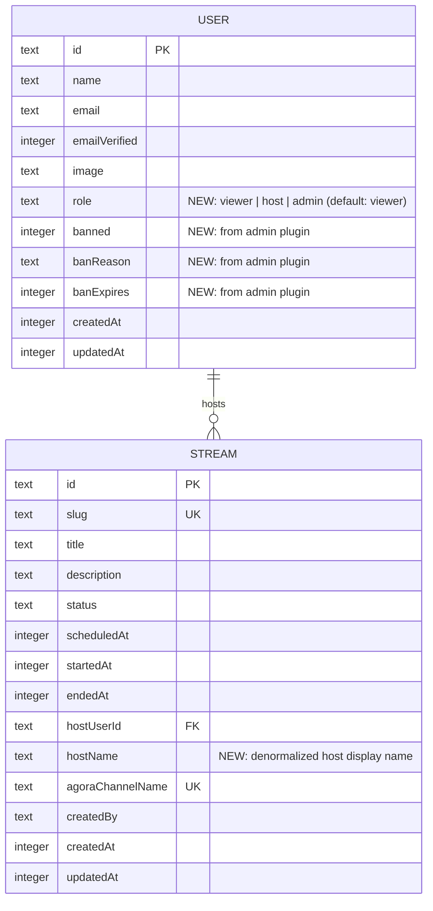

# Agora UI Pages

## Overview

Build the frontend UI for the Agora video streaming integration: a public homepage for browsing streams, an authenticated role-gated dashboard for stream and user management, a permissions model using Better-Auth's admin plugin, and a dev seed script for local testing.

## Problem Statement / Motivation

The backend API for stream management, Agora token generation, and cloud recording exists, but the frontend only has scaffolding pages with no role gating, no public stream browsing, and no user management. Users cannot discover streams without logging in, and any authenticated user can create/manage streams regardless of their role.

## Proposed Solution

Five implementation phases, ordered by dependency:

1. **Permissions foundation** — Better-Auth admin plugin + role column + seed script
2. **Backend endpoints** — Public stream listing, host name denormalization, role-based permission checks
3. **Public homepage** — Stream browsing with three sections (live, upcoming, past)
4. **Dashboard improvements** — Layout route, role gating, user management
5. **Polish** — Empty states, navigation, edge case handling

---

## Phase 1: Permissions Foundation

### 1a. Add Better-Auth Admin Plugin to Auth Worker

Better-Auth ships a built-in `admin` plugin that adds `role`, `banned`, `banReason`, `banExpires` columns to the `user` table and provides admin API endpoints (see brainstorm: `docs/brainstorms/2026-02-24-agora-ui-pages-brainstorm.md`).

**Files to modify:**

- `workers/auth-worker/src/lib/auth.ts` — Add admin plugin:
  ```typescript
  import { admin } from "better-auth/plugins";

  // Inside betterAuth config:
  plugins: [
    admin({
      defaultRole: "viewer",
      adminRoles: ["admin"],
    }),
  ],
  ```

- `workers/auth-worker/src/db/schema.ts` — Add columns that the admin plugin expects:
  ```typescript
  // Add to user table:
  role: text("role").default("viewer"),
  banned: integer("banned", { mode: "boolean" }),
  banReason: text("ban_reason"),
  banExpires: integer("ban_expires", { mode: "timestamp" }),
  ```

- Run `pnpm db:generate && pnpm db:migrate:local` to create the migration.

**Admin plugin provides these endpoints automatically (all require admin session):**
- `POST /api/auth/admin/set-role` — Set a user's role
- `GET /api/auth/admin/list-users` — Paginated user list with search/filter
- `POST /api/auth/admin/create-user` — Create a user as admin
- `POST /api/auth/admin/ban-user` / `unban-user`

This eliminates the need to build custom user management endpoints on auth-worker.

### 1b. Update Frontend Auth Client

**File:** `apps/web/src/lib/auth-client.ts`

```typescript
import { adminClient, inferAdditionalFields } from "better-auth/client/plugins";

export const authClient = createAuthClient({
  baseURL: import.meta.env.VITE_AUTH_WORKER_URL ?? "http://localhost:8788",
  fetchOptions: { credentials: "include" },
  plugins: [
    inferAdditionalFields({
      user: { role: { type: "string" } },
    }),
    adminClient(),
  ],
});
```

This gives the frontend:
- `session.user.role` properly typed
- `authClient.admin.setRole()`, `authClient.admin.listUsers()`, etc.

### 1c. Update Video Worker Auth Helper

**File:** `workers/video-worker/src/lib/auth.ts`

The `requireAuth` helper forwards cookies to auth-worker's `/api/auth/get-session`. The response already includes the full user object — after adding the `role` column, it will be present in the response. Update the return type to include `role: string`.

### 1d. Dev Seed Script

**New file:** `scripts/seed-dev.sh` (or `scripts/seed-dev.ts`)

The script runs as part of `pnpm dev` startup (after `db:migrate:local`, before dev servers start). It:

1. Starts the auth-worker temporarily (or waits for it to be ready)
2. Creates three users via `POST /api/auth/sign-up/email`:
   - `admin@example.com` / `password` / name: "Admin User"
   - `host@example.com` / `password` / name: "Host User"
   - `viewer@example.com` / `password` / name: "Viewer User"
3. Sets roles via D1 directly:
   ```bash
   wrangler d1 execute AUTH_DB --local --command "UPDATE user SET role = 'admin' WHERE email = 'admin@example.com'"
   wrangler d1 execute AUTH_DB --local --command "UPDATE user SET role = 'host' WHERE email = 'host@example.com'"
   # viewer@example.com already has 'viewer' as default
   ```
4. The script is idempotent — skips users that already exist (handle 409 from signup).

**Integration into `pnpm dev`:**

Update the Turborepo pipeline so the seed script runs after `db:migrate:local` completes but before `dev` servers start. This could be:
- A new `db:seed:local` Turbo task that depends on `db:migrate:local`
- The `dev` task depends on `db:seed:local` instead of `db:migrate:local` directly

**Challenge:** The seed script needs the auth-worker running to call signup endpoints, but `pnpm dev` is what starts the auth-worker. Two approaches:
- **Option A:** Start auth-worker in the background, run seed, then let Turbo manage the full `dev`. Complex.
- **Option B:** Use `wrangler d1 execute` with direct SQL INSERTs that replicate Better-Auth's password hashing (scrypt). Fragile if Better-Auth changes hashing.
- **Option C:** Make the seed script a separate `pnpm db:seed` command that developers run once after first setup, and document it. Simpler and avoids the startup ordering problem.

**Recommendation:** Option C — a separate `pnpm db:seed` command. The dev startup already runs migrations; seeding is a one-time setup action. Baking it into every `pnpm dev` run adds complexity for little benefit since D1 is persistent across dev sessions.

> **Note:** The brainstorm specified baking into `pnpm dev`. If that's a hard requirement, Option A is the path — add a `db:seed:local` script that spawns a temporary wrangler dev instance, calls the signup API, kills it, then runs the D1 role updates.

---

## Phase 2: Backend Endpoints

### 2a. Host Name Denormalization

**Problem:** The `stream` table stores `hostUserId` but not the host's display name. The host name lives in auth-worker's D1 database (a separate worker with a separate database). The homepage needs to show host names on stream cards.

**Solution:** Add a `hostName` column to the `stream` table in video-worker.

**File:** `workers/video-worker/src/db/schema.ts`
```typescript
// Add to stream table:
hostName: text("host_name"),
```

**File:** `workers/video-worker/src/routes/streams.ts`
- `POST /api/streams` — Accept `hostName` in the request body alongside `hostUserId`. The frontend already has `session.user.name` available at creation time.
- `PATCH /api/streams/:id` — If `hostUserId` changes, require `hostName` to be updated as well.

Run `pnpm db:generate && pnpm db:migrate:local`.

### 2b. Public Stream Listing Endpoint

**File:** `workers/video-worker/src/routes/streams.ts`

New endpoint: `GET /api/streams/public`
- **No authentication required**
- Returns streams filtered to `live`, `scheduled`, `pre_stream`, `paused`, and `completed` statuses
- Excludes `draft`, `ending`, `processing`, `cancelled`
- Ordered by `scheduledAt`
- Returns: `{ live: Stream[], upcoming: Stream[], past: Stream[] }`
  - `live` = status `live` or `paused`
  - `upcoming` = status `scheduled` or `pre_stream`
  - `past` = status `completed`, limited to most recent 20

**File:** `apps/web/src/lib/video-client.ts`
- Add `listPublicStreams()` function

### 2c. Role-Based Permission Checks on Video Worker

**File:** `workers/video-worker/src/routes/streams.ts`

Add role checks to existing endpoints:
- `POST /api/streams` — Require role `host` or `admin`
- `PATCH /api/streams/:id` — Require role `host` (own streams only) or `admin` (any stream)
- `DELETE /api/streams/:id` — Same ownership/admin check
- `GET /api/streams` (authenticated list) — Hosts see only streams where `hostUserId === auth.user.id`; admins see all

### 2d. Shared Types Update

**File:** `packages/shared/src/types/index.ts`

Add:
```typescript
export type UserRole = "viewer" | "host" | "admin";

export interface PublicStreamListing {
  live: Stream[];
  upcoming: Stream[];
  past: Stream[];
}
```

---

## Phase 3: Public Homepage

### 3a. Redesign Homepage Route

**File:** `apps/web/src/routes/index.tsx`

Replace the current landing page with stream listings. The page:
- Fetches `listPublicStreams()` on mount (no auth needed)
- Renders three sections:
  1. **Currently Streaming** — `live` streams with prominent "Watch Now" CTA
  2. **Upcoming Streams** — `upcoming` streams sorted by soonest first
  3. **Past Streams** — `past` streams with "Watch Replay" CTA
- Each section hides entirely if empty (no empty state messages for individual sections)
- If ALL sections are empty, show a centered "No streams yet — check back soon" message
- Shows a "Dashboard" link in the header if the user is logged in with `host` or `admin` role
- Shows "Sign In" link if not logged in

### 3b. Stream Card Component

**New file:** `apps/web/src/components/stream/StreamCard.tsx`

Extract from the inline `StreamCard` in `dashboard.streams.tsx` and enhance:
- Title, host name, scheduled date/time (user's local timezone), status badge
- CTA button varies by status:
  - `live` / `paused` → "Watch Now" (links to `/event/:slug`)
  - `scheduled` / `pre_stream` → "Set Reminder" or just shows date
  - `completed` → "Watch Replay" (links to `/event/:slug`)
- Follows existing card pattern: `bg-white rounded-xl shadow-sm hover:shadow-md transition-shadow`

### 3c. Extract StatusBadge Component

**New file:** `apps/web/src/components/stream/StatusBadge.tsx`

Currently duplicated inline in `dashboard.streams.tsx` and `dashboard.streams.$id.tsx`. Extract to a shared component.

---

## Phase 4: Dashboard Improvements

### 4a. Dashboard Layout Route

**File:** `apps/web/src/routes/dashboard.tsx`

Convert from a standalone page to a **layout route**:
- Render a top navigation bar with links: "Streams", "Users" (admin only)
- Show user info (name, role badge) and sign-out button in the nav
- Render `<Outlet />` for child routes
- **Role gate:** If `session.user.role` is `viewer`, redirect to `/` or show "Access Denied"

The current session info content on `/dashboard` moves to a default child route or into the nav bar.

### 4b. Dashboard Index Route

**New file:** `apps/web/src/routes/dashboard.index.tsx`

Redirect to `/dashboard/streams` (the default dashboard view).

### 4c. Update Stream Management Pages

**Files:**
- `apps/web/src/routes/dashboard.streams.tsx` — Update to use shared `StreamCard` and `StatusBadge` components. For hosts, filter to show only their streams. For admins, show all.
- `apps/web/src/routes/dashboard.streams.new.tsx` — Add role check (host or admin). Pass `hostName: session.user.name` when creating stream.
- `apps/web/src/routes/dashboard.streams.$id.tsx` — Add ownership check for hosts; admins can edit any stream. Use shared `StatusBadge`.

### 4d. User Management Page

**New file:** `apps/web/src/routes/dashboard.users.tsx` → `/dashboard/users`

- Only accessible to `admin` role (redirect others)
- Uses `authClient.admin.listUsers()` from Better-Auth admin client plugin
- Three groups displayed in order: Admins, Hosts, Viewers
- Search bar filters across all groups by name or email
- Each user row shows: name, email, current role, action buttons
- Role change: dropdown or buttons to promote/demote
  - Uses `authClient.admin.setRole({ userId, role })`
  - Confirmation before changing role
  - Cannot demote yourself (prevent zero-admin state)

---

## Phase 5: Polish & Edge Cases

### 5a. Navigation Improvements
- Add a back link / logo on the event page (`/event/:slug`) that links to `/`
- Add "Dashboard" link on homepage header for admin/host users
- Add "Home" link in dashboard nav

### 5b. Stream Status Edge Cases on Homepage
- `pre_stream` streams show in "Upcoming" (they haven't gone live yet)
- `paused` streams show in "Currently Streaming" with a "Paused" badge
- `draft`, `ending`, `processing`, `cancelled` streams are excluded from the public listing

### 5c. Empty States
- Homepage: hide empty sections; if all empty, show "No streams yet" centered message
- Dashboard streams: show "No streams yet. Create your first stream." with CTA
- User management: show "No users found" for empty search results

---

## Technical Considerations

### Architecture Impacts
- Better-Auth admin plugin owns the `role` column — do not also use `additionalFields` for role
- `hostName` denormalization trades consistency for simplicity (if a user changes their display name, existing streams keep the old name — acceptable tradeoff)
- The video-worker's `requireAuth` helper needs to surface `role` so permission checks can happen in route handlers

### Security Considerations
- Role checks must happen server-side (video-worker + auth-worker), not just on the frontend
- The admin plugin's endpoints are already gated to admin sessions
- Public stream listing endpoint must not leak `draft` or `cancelled` streams
- Seed script passwords are plaintext `"password"` — dev only, never for production

### System-Wide Impact
- **API surface parity:** The new `GET /api/streams/public` endpoint is the only new unauthenticated video-worker endpoint. All other changes are modifications to existing authenticated endpoints.
- **State lifecycle:** `hostName` denormalization introduces a potential stale-name scenario. Acceptable for MVP; can be refreshed on demand later.

---

## Acceptance Criteria

- [x] Admin plugin installed; `role` column exists on `user` table with `viewer` default
- [x] Frontend `session.user.role` is typed and populated
- [x] Dev seed script creates admin/host/viewer test users with correct roles
- [x] `GET /api/streams/public` returns live, upcoming, and past streams without auth
- [x] Homepage shows three sections (Currently Streaming, Upcoming, Past) with stream cards
- [x] Homepage is accessible without login
- [x] Dashboard is only accessible to `host` and `admin` roles
- [x] Hosts see only their own streams in the dashboard
- [x] Admins see all streams in the dashboard
- [x] User management page (admin only) lists users grouped by role with search
- [x] Admin can promote/demote users via the user management page
- [x] `POST /api/streams` requires `host` or `admin` role
- [x] Stream edit/cancel enforces ownership for hosts, unrestricted for admins
- [x] `StatusBadge` extracted to shared component (no duplication)
- [x] `StreamCard` extracted to shared component used on both homepage and dashboard

---

## Dependencies & Risks

| Risk | Mitigation |
|------|------------|
| Better-Auth admin plugin may not work cleanly with Cloudflare D1 adapter | Test early in Phase 1; fall back to manual `additionalFields` + custom endpoints if needed |
| Seed script startup ordering (auth-worker must be running) | Use separate `pnpm db:seed` command; document in README |
| `hostName` goes stale if user changes display name | Acceptable for MVP; add refresh mechanism later |
| `ending → processing → completed` transitions unimplemented | Homepage "Past Streams" will be empty until this is addressed; out of scope for this plan |

---

## ERD: Schema Changes



---

## Sources & References

- **Origin brainstorm:** [docs/brainstorms/2026-02-24-agora-ui-pages-brainstorm.md](docs/brainstorms/2026-02-24-agora-ui-pages-brainstorm.md) — Key decisions: public homepage, admin-only promotion (Option A), no sidebar dashboard, three test seed users
- **Better-Auth admin plugin docs:** Provides `role`, `banned` fields + admin CRUD endpoints (`set-role`, `list-users`, `create-user`)
- **Existing patterns:** `apps/web/src/lib/video-client.ts` (API client), `apps/web/src/routes/dashboard.streams.tsx` (dashboard page pattern), `workers/video-worker/src/routes/streams.ts` (stream CRUD)
- **SpecFlow analysis:** Identified 17 gaps including missing public endpoint, host name cross-worker problem, permission boundary gaps, state transition UI gaps
